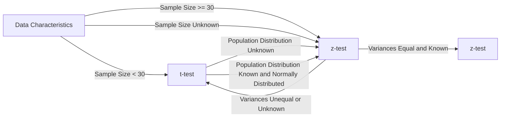

```py
# Importing the necessary packages
import numpy as np                                  # "Scientific computing"
import scipy.stats as stats                         # Statistical tests

import pandas as pd                                 # Data Frame
from pandas.api.types import CategoricalDtype

import matplotlib.pyplot as plt                     # Basic visualisation
from statsmodels.graphics.mosaicplot import mosaic  # Mosaic diagram
import seaborn as sns                                # Advanced data visualisation
from sklearn.linear_model import LinearRegression   
```

# H1 - Samples
```py
# Data inlezen (kijken welke sep dat het is, meestal ; of ,) -> default is ,
data = pd.read_csv("data.csv", sep=";")

# Data bekijken
data.head() # eerste 5 rijen

# Properties van de data bekijken
# Print data information
print("Data information:")
print(data.info()) # prints column names and data types

# Print number of rows and columns
print("\nNumber of rows and columns:")
print("Rows:", len(data)) # prints number of rows
print("Columns:", len(data.columns)) # prints number of columns

# Print shape of data
print("\nShape of data:")
print(data.shape) # prints number of rows and columns

# Print data types
print("\nData types:")
print(data.dtypes) # prints data types of columns

# het aantal unieke waarden in een kolom
data["kolomnaam"].unique()

# hoeveel van elk datatype zit er in
# volledige dataset
data.dtypes.value_counts()
# per kolom
data["kolomnaam"].value_counts()

# indexen
data.index # geeft de indexen weer
data.set_index("kolomnaam", inplace=True) # zet de kolom als index
```

## Kwalitatieve variabelen
```py
# Kwalitatieve variabelen moeten omgezet worden naar een category
data["kolomnaam"] = data["kolomnaam"].astype("category")

# Kwalitatieve variabelen omzetten naar een category met een bepaalde volgorde -> ordinal variable
# bv. een rating van 1 tot 5
# maak een lijst aan met de volgorde
rating_order = ["1", "2", "3", "4", "5"]
# maak een CategoricalDtype aan met de volgorde
rating_type = CategoricalDtype(categories=rating_order, ordered=True)
# zet de kolom om naar een category met de volgorde
data["kolomnaam"] = data["kolomnaam"].astype(rating_type)
# deze volgorde wordt gebruikt bij het plotten van de data
```

## Selecteren van data
```py
# Selecteren van kolommen
data["kolomnaam"] # geeft de kolom terug
data.kolomnaam # geeft de kolom terug
data[["kolomnaam1", "kolomnaam2"]] # geeft de kolommen terug in een dataframe

# Selecteren van rijen
data.iloc[0] # geeft de eerste rij terug -> tellen vanaf 0
data.iloc[0:5] # geeft de eerste 5 rijen terug -> tellen vanaf 0 -> exclusief de laatste index

# Query's
data[data["kolomnaam"] == "waarde"] # geeft alle rijen terug waar de kolomnaam de waarde heeft
#of
data.query("kolomnaam == 'waarde'")

# query's voor bepaalde kolomen
data[(data["kolomnaam1"] == "waarde1") & (data["kolomnaam2"] == "waarde2")][["kolomnaam1", "kolomnaam2"]]
```

## Droppen van data
```py
# Droppen van kolommen
data.drop("kolomnaam", axis="columns", inplace=True) # axis=1 -> kolom, axis=0 -> rij
of
data = data.drop("kolomnaam", axis="columns")

# veel lege waardes in een kolom?
data.dropna() #dropt elke rij waar er een lege waarde in zit -> niet aan te raden
data.dropna(how="all") #dropt elke rij waar alle waardes leeg zijn

# legen waardes vervangen door een waarde
data["kolomnaam"].fillna("waarde", inplace=True)
```

## Creëren van nieuwe kolommen
```py
# Creëren van nieuwe kolommen
data["nieuwecol"] = #iets van data of een berekening

# mappen van waardes
map_dict = {"waarde1": "nieuwewaarde1", "waarde2": "nieuwewaarde2"}
data["nieuwecol"] = data["kolomnaam"].map(map_dict)

# kan ook met functie
def functie(x):
    if x == "waarde1":
        return "nieuwewaarde1"
    elif x == "waarde2":
        return "nieuwewaarde2"
    else:
        return "waarde3"

data["nieuwecol"] = data["kolomnaam"].map(functie)

```

-----

# H2 - Analyse van 1 variabele

# Kwalitatieve variabelen
```py
# barchart
sns.catplot(x="kolomnaam", kind="count", data=data) # count -> telt het aantal waardes per categorie
# of
sns.countplot(x="kolomnaam", data=data)

# centrality measures
data.mode() # geeft de modus terug -> meest voorkomende waarde
data["kolomnaam"].mode() # geeft de modus terug -> meest voorkomende waarde
data.describe() # geeft een overzicht van de data -> count, mean, std, min, max, 25%, 50%, 75%
```

# Kwantitatieve variabelen
```py
# histogram

# Boxplot -> geeft de 5 getallen weer -> min, 25%, 50%, 75%, max
sns.boxplot(data=data, x="kolomnaam") # x -> kolomnaam, y -> waarde
# of violinplot -> geeft de distributie weer
sns.violinplot(data=data, x="kolomnaam") # x -> kolomnaam, y -> waarde
# of kernel density plot (kde) -> geeft de distributie weer in 1 curve
sns.kdeplot(x = data["kolomnaam"])

# combineren histogram en density plot -> historgram met distributiecruve
sns.distplot(x = data["kolomnaam"], kde=True) # histogram + density plot

# centrality and dispersion measures
## Mean, st and friends
print(f"mean: {data['kolomnaam'].mean()}")
print(f"Standard deviation: {data['kolomnaam'].std()}") # Pay attention: n-1 in the denominator
print(f"Variance: {data['kolomnaam'].var()}") # Pay attention: n-1 in the denominator
print(f"skewness: {data['kolomnaam'].skew()}")
print(f"kurtosis: {data['kolomnaam'].kurtosis()}")

##median & friends
print(f"minimum: {data['kolomnaam'].min()}")
print(f"median: {data['kolomnaam'].median()}")
print(f"maximum: {data['kolomnaam'].max()}")

print(f"percentile 25%: {data['kolomnaam'].quantile(0.25)}")
print(f"percentile 50%: {data['kolomnaam'].quantile(0.5)}")
print(f"percentile 75%: {data['kolomnaam'].quantile(0.75)}")

print(f"iqr (interquartile range): {data['kolomnaam'].quantile(0.75) - data['kolomnaam'].quantile(0.25)}")
print(f"range: {data['kolomnaam'].max() - data['kolomnaam'].min()}")

# of ge zijt slim en doet
data.describe()
```

## Formule voor de standaard deviatie
```py
# BIJ SAMPLE GEBRUIK JE N - 1
# BIJ POPULATIE GEBRUIK JE N
# dit omdat je zo een betere schatting hebt van de populatie

# Bij pandas word standaard de sample gebruikt
# Bij numpy word standaard de populatie gebruikt
print(f"Pandas uses ddof=1 by default: {data['col'].std()}") # ddof -> delta degrees of freedom kun je specifiëren
print(f"Numpy  uses ddof=0 by default: {np.std(data['col'])}")

#pandas
print(f"Standard deviation population: {data['col'].std(ddof=0)}")
print(f"Standard deviation sample    : {data['col'].std()}")

#numpy
print(f"Standard deviation population: {np.std(a)}")
print(f"Standard deviation sample    : {np.std(a, ddof=1)}")
```


H3
- z-test
    - right-tailed
    - left-tailed
    - two-tailed
- t-test
    - right-tailed
    - left-tailed
    - two-tailed

H4 -> 2 kwalitatieve variabelen
- chi-quadraat test voor onafhankelijkheid
- goodness of fit test -> controleren of sample representatief is voor de populatie
- standardised residuals -> kijken of uw sample overrepresentatief is voor een bepaalde groep of niet

h5 -> 1 kalitatieve variabele en 1 kwantitatieve variabele
- two sample t-test
    - vergelijken van het gemiddelde van 2 groepen (niet perse even groot)
    - gemiddelde van 2 verschillende groepen
- paired samples
    - vergelijken van dingen op dezelfde groep bv
    - Voorbeelden 
    ```
        Before and after measurements: Paired samples are often used when you want to compare the measurements of the same variable before and after a treatment or intervention. For example, you might measure the blood pressure of individuals before and after they undergo a specific treatment to see if there is a significant change.

        Matched pairs: Paired samples analysis is useful when you have a natural pairing or matching between the observations in the two data sets. For instance, in a study comparing the effectiveness of two different drugs, you might pair each participant with another participant who has similar characteristics, such as age, gender, or disease severity. Then, you would measure the outcomes for each pair under the different drug conditions.

        Repeated measures: Paired samples can be used when you have multiple measurements taken on the same subject over time or under different conditions. This could include measuring variables like reaction time, performance scores, or pain levels before and after different treatments within the same individuals.
    ```

h6 -> 2 kwantitatieve variabelen
- regressie
- covariantie + R + R^2

H7 -> time series
- moving averages
    - simple moving average
    - weighted moving average
    - exponential moving average
- exponential smoothing
    - single exponential smoothing -> exponential smoothing
    - double exponential smoothing -> Holt's method
    - triple exponential smoothing -> Holt-Winters method

