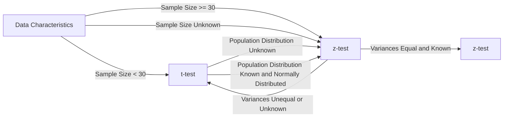

```py
# Importing the necessary packages
import numpy as np                                  # "Scientific computing"
import scipy.stats as stats                         # Statistical tests

import pandas as pd                                 # Data Frame
from pandas.api.types import CategoricalDtype

import random
import math

import matplotlib.pyplot as plt                     # Basic visualisation
from statsmodels.graphics.mosaicplot import mosaic  # Mosaic diagram
import seaborn as sns                                # Advanced data visualisation
from sklearn.linear_model import LinearRegression
import altair as alt                                # Alternative visualisation system
```

# H1 - Samples

```py
# Data inlezen (kijken welke sep dat het is, meestal ; of ,) -> default is ,
data = pd.read_csv("data.csv", sep=";")

# Data bekijken
data.head() # eerste 5 rijen

# Properties van de data bekijken
# Print data information
print("Data information:")
print(data.info()) # prints column names and data types

# Print number of rows and columns
print("\nNumber of rows and columns:")
print("Rows:", len(data)) # prints number of rows
print("Columns:", len(data.columns)) # prints number of columns

# Print shape of data
print("\nShape of data:")
print(data.shape) # prints number of rows and columns

# Print data types
print("\nData types:")
print(data.dtypes) # prints data types of columns

# het aantal unieke waarden in een kolom
data["kolomnaam"].unique()

# hoeveel van elk datatype zit er in
# volledige dataset
data.dtypes.value_counts()
# per kolom
data["kolomnaam"].value_counts()

# indexen
data.index # geeft de indexen weer
data.set_index("kolomnaam", inplace=True) # zet de kolom als index
```

## Kwalitatieve variabelen

```py
# Kwalitatieve variabelen moeten omgezet worden naar een category
data["kolomnaam"] = data["kolomnaam"].astype("category")

# Kwalitatieve variabelen omzetten naar een category met een bepaalde volgorde -> ordinal variable
# bv. een rating van 1 tot 5
# maak een lijst aan met de volgorde
rating_order = ["1", "2", "3", "4", "5"]
# maak een CategoricalDtype aan met de volgorde
rating_type = CategoricalDtype(categories=rating_order, ordered=True)
# zet de kolom om naar een category met de volgorde
data["kolomnaam"] = data["kolomnaam"].astype(rating_type)
# deze volgorde wordt gebruikt bij het plotten van de data
```

## Selecteren van data

```py
# Selecteren van kolommen
data["kolomnaam"] # geeft de kolom terug
data.kolomnaam # geeft de kolom terug
data[["kolomnaam1", "kolomnaam2"]] # geeft de kolommen terug in een dataframe

# Selecteren van rijen
data.iloc[0] # geeft de eerste rij terug -> tellen vanaf 0
data.iloc[0:5] # geeft de eerste 5 rijen terug -> tellen vanaf 0 -> exclusief de laatste index

# Query's
data[data["kolomnaam"] == "waarde"] # geeft alle rijen terug waar de kolomnaam de waarde heeft
#of
data.query("kolomnaam == 'waarde'")

# query's voor bepaalde kolomen
data[(data["kolomnaam1"] == "waarde1") & (data["kolomnaam2"] == "waarde2")][["kolomnaam1", "kolomnaam2"]]
```

## Droppen van data

```py
# Droppen van kolommen
data.drop("kolomnaam", axis="columns", inplace=True) # axis=1 -> kolom, axis=0 -> rij
of
data = data.drop("kolomnaam", axis="columns")

# veel lege waardes in een kolom?
data.dropna() #dropt elke rij waar er een lege waarde in zit -> niet aan te raden
data.dropna(how="all") #dropt elke rij waar alle waardes leeg zijn

# legen waardes vervangen door een waarde
data["kolomnaam"].fillna("waarde", inplace=True)
```

## Creëren van nieuwe kolommen

```py
# Creëren van nieuwe kolommen
data["nieuwecol"] = #iets van data of een berekening

# mappen van waardes
map_dict = {"waarde1": "nieuwewaarde1", "waarde2": "nieuwewaarde2"}
data["nieuwecol"] = data["kolomnaam"].map(map_dict)

# kan ook met functie
def functie(x):
    if x == "waarde1":
        return "nieuwewaarde1"
    elif x == "waarde2":
        return "nieuwewaarde2"
    else:
        return "waarde3"

data["nieuwecol"] = data["kolomnaam"].map(functie)

```

---

# H2 - Analyse van 1 variabele

## Kwalitatieve variabelen

```py
# barchart
sns.catplot(x="kolomnaam", kind="count", data=data) # count -> telt het aantal waardes per categorie
# of
sns.countplot(x="kolomnaam", data=data)

# centrality measures
data.mode() # geeft de modus terug -> meest voorkomende waarde
data["kolomnaam"].mode() # geeft de modus terug -> meest voorkomende waarde
data.describe() # geeft een overzicht van de data -> count, mean, std, min, max, 25%, 50%, 75%
```

## Kwantitatieve variabelen

```py
# histogram

# Boxplot -> geeft de 5 getallen weer -> min, 25%, 50%, 75%, max
sns.boxplot(data=data, x="kolomnaam") # x -> kolomnaam, y -> waarde
# of violinplot -> geeft de distributie weer
sns.violinplot(data=data, x="kolomnaam") # x -> kolomnaam, y -> waarde
# of kernel density plot (kde) -> geeft de distributie weer in 1 curve
sns.kdeplot(x = data["kolomnaam"])

# combineren histogram en density plot -> historgram met distributiecruve
sns.distplot(x = data["kolomnaam"], kde=True) # histogram + density plot

# centrality and dispersion measures
## Mean, st and friends
print(f"mean: {data['kolomnaam'].mean()}")
print(f"Standard deviation: {data['kolomnaam'].std()}") # Pay attention: n-1 in the denominator
print(f"Variance: {data['kolomnaam'].var()}") # Pay attention: n-1 in the denominator
print(f"skewness: {data['kolomnaam'].skew()}")
print(f"kurtosis: {data['kolomnaam'].kurtosis()}")

##median & friends
print(f"minimum: {data['kolomnaam'].min()}")
print(f"median: {data['kolomnaam'].median()}")
print(f"maximum: {data['kolomnaam'].max()}")

print(f"percentile 25%: {data['kolomnaam'].quantile(0.25)}")
print(f"percentile 50%: {data['kolomnaam'].quantile(0.5)}")
print(f"percentile 75%: {data['kolomnaam'].quantile(0.75)}")

print(f"iqr (interquartile range): {data['kolomnaam'].quantile(0.75) - data['kolomnaam'].quantile(0.25)}")
print(f"range: {data['kolomnaam'].max() - data['kolomnaam'].min()}")

# of ge zijt slim en doet
data.describe()
```

### Formule voor de standaard deviatie

```py
# BIJ SAMPLE GEBRUIK JE N - 1
# BIJ POPULATIE GEBRUIK JE N
# dit omdat je zo een betere schatting hebt van de populatie

# Bij pandas word standaard de sample gebruikt
# Bij numpy word standaard de populatie gebruikt
print(f"Pandas uses ddof=1 by default: {data['col'].std()}") # ddof -> delta degrees of freedom kun je specifiëren
print(f"Numpy  uses ddof=0 by default: {np.std(data['col'])}")

#pandas
print(f"Standard deviation population: {data['col'].std(ddof=0)}")
print(f"Standard deviation sample    : {data['col'].std()}")

#numpy
print(f"Standard deviation population: {np.std(a)}")
print(f"Standard deviation sample    : {np.std(a, ddof=1)}")
```

# H3

Discrete random variable -> een variabele die een beperkt aantal waardes kan aannemen
Continuous random variable -> een variabele die een oneindig aantal waardes kan aannemen

- Kans type 1 fout = alpha

## Central Limit Theorem

- De som van een groot aantal onafhankelijke random variabelen is ongeveer normaal verdeeld
- Hoe groter de steekproef, hoe beter de benadering

- Hier is de sigma ALTIJD bij sample = **standaardafwijking / sqrt(n)**

- confidence interval -large sample -> een interval waarin de parameter met een bepaalde kans ligt

```py
# Step 1.
m = 324.6      # Sample mean
s = 2.5      # Population standard deviation
n = 45      # Sample size
alpha = .05  # 1 - alpha is the confidence level

# Step 2.
z = stats.norm.isf(alpha/2)
print("z-score: %.5f" % z)

# Step 3.
lo = m - z * s / np.sqrt(n)
hi = m + z * s / np.sqrt(n)
print("Confidence interval: [%.4f, %.4f]" % (lo, hi))
```

- confidence interval -small sample -> students t test

```py
# Step 1.
m = 5.2      # Sample mean
s = 1.5      # Sample (!) standard deviation
n = 15       # Sample size
alpha = .05  # 1 - alpha is the confidence level

# Stap 2.
t = stats.t.isf(alpha/2, df = n - 1)
print("t-score: %.5f" % t)

# Stap 3.
lo = m - t * s / np.sqrt(n)
hi = m + t * s / np.sqrt(n)
print("Confidence interval: [%.4f, %.4f]" % (lo, hi))
```

### The normal distribution

#### Plotting density function of a normal distribution

```py
# STANDAARD NORMAL DISTRIBUTIE -> mean = 0, std = 1
# Take 100 values for the X-axis, between -4 and 4, evenly spaced
x = np.linspace(-4, +4, num=101)
y = stats.norm.pdf(x, 0, 1)
# Plot the probability density function (pdf) for these X-values
plt.plot(x, y)

# voor een normale distributie met mean = 5 en std = 1.5 -> de vorm van de grafiek is identiek gewoon op andere schaal
m = 5    # Gemiddelde
s = 1.5  # Standaardafwijking
x = np.linspace(m - 4 * s, m + 4 * s, num=201)
plt.plot(x, stats.norm.pdf(x, loc=m, scale=s))

```

#### Plotting histogram of a sample with theoretical probability density

```py
# Histogram of the sample
plt.hist(sample, bins=20, density=True, label="Histogram of the sample")
# of
sns.distplot(sample, kde=True, label="Histogram of the sample")

```

#### Probability distribution in the normal distribution

**Student $t$-distribution in Python**  
Import scipy.stats  
For a $t$-distribution with df degrees of freedom: (df = degrees of freedom)

| **Function**           | **Purpose**                                                 |
| ---------------------- | ----------------------------------------------------------- |
| stats.t.pdf(x, df=d)   | Probability density for $x$                                 |
| stats.t.cdf(x, df=d)   | Left-tail probability 𝑃(𝑋 < x)                              |
| stats.t.sf(x, df=d)    | Right-tail probability 𝑃(𝑋 > x)                             |
| stats.t.isf(1-p, df=d) | p% of observations are expected to be lower than this value |

**Normal distribution in Python**
**Python functions**

Import scipy.stats  
For a normal distribution with mean m and standard deviation s:

| **Function**                        | **Purpose**                                             |
| ----------------------------------- | ------------------------------------------------------- |
| stats.norm.pdf(x, loc=m, scale=s)   | Probability density at $x$                              |
| stats.norm.cdf(x, loc=m, scale=s)   | Left-tail probability 𝑃(𝑋 < x)                          |
| stats.norm.sf(x, loc=m, scale=s)    | Right-tail probability 𝑃(𝑋 > x)                         |
| stats.norm.isf(1-p, loc=m, scale=s) | p% of observations are expected to be lower than result |

#### More examples of probability calculations

### confidence intervals

### Confidence intervals for small samples

```py

```



Requirements z-test:

- Random sample
- Sample groot genoeg (n >= 30)
  - als normaal verdeeld is is sample size niet relevant
- normaal verdeeld
- populatie standaard deviatie is gekend

indien 1 van deze niet voldaan is gebruik je de t-test en deze normaal verdeeld is

## Z-test

### right-tailed

```py
## RIGHT TAIL Z-TEST
#Step 1: formulate the null and alternative hypotheses
#- H0: μ = 100
#- H1: μ > 100

#Step 2: specify the significance level
# Properties of the sample:
n = 50      # sample size
sm = 20.2  # sample mean
s = 0.4    # population standard deviation (assumed to be known)
a = 0.05    # significance level (chosen by the researcher)
m0 = 20.0    # hypothetical population mean (H0)

# Plotting the sample distribution
# Gauss-curve plot:
# X-values
dist_x = np.linspace(m0 - 4 * s/np.sqrt(n), m0 + 4 * s/np.sqrt(n), num=201)
# Y-values for the Gauss curve
dist_y = stats.norm.pdf(dist_x, m0, s/np.sqrt(n))
fig, dplot = plt.subplots(1, 1)
# Plot the Gauss-curve
dplot.plot(dist_x, dist_y)
# Show the hypothetical population mean with an orange line
dplot.axvline(m0, color="orange", lw=2)
# Show the sample mean with a red line
dplot.axvline(sm, color="red")

#Step 3: compute the test statistic (red line in the plot)
# Hier is dat 20.2

#Step 4:
## method 1
# Determine the $p$-value and reject $H_0$ if $p < \alpha$.
#The $p$-value is the probability, if the null hypothesis is true, to obtain
# a value for the test statistic that is at least as extreme as the
# observed value
p = stats.norm.sf(sm, loc=m0, scale=s/np.sqrt(n))
print("p-value: %.5f" % p)
if(p < a):
    print("p < a: reject H0")
else:
    print("p > a: do not reject H0")

## method 2
# An alternative method is to determine the critical region, i.e. the set of all values for the sample mean where $H_0$ may be rejected.
# The boundary of that area is called the critical value $g$. To the left of it you can't reject $H_0$ (acceptance region), to the right you can (critical region). The area of the acceptance region is $1 - \alpha$, the area of the critical region is $\alpha$.
g = stats.norm.isf(a, loc = m0, scale = s / np.sqrt(n))
print("Critical value g ≃ %.3f" % g)
if (sm < g):
    print("sample mean = %.3f < g = %.3f: do not reject H0" % (sm, g))
else:
    print("sample mean = %.3f > g = %.3f: reject H0" % (sm, g))


# Step 5
# We can conclude that if we assume that  $H_0$  is true, the probability to draw a sample from this population with this particular value for  $\bar{x}$  is very small indeed. With the chosen significance level, we can reject the null hypothesis.

```

### left-tailed

```py
## LEFT TAIL Z-TEST
#Step 1: formulate the null and alternative hypotheses
#- H0: μ = 100
#- H1: μ < 100

#Step 2: specify the significance level
# Properties of the sample:
n = 50      # sample size
sm = 19.94  # sample mean
s = 0.4    # population standard deviation (assumed to be known)
a = 0.05    # significance level (chosen by the researcher)
m0 = 20.0    # hypothetical population mean (H0)

# Plotting the sample distribution
# Gauss-curve plot:
# X-values
dist_x = np.linspace(m0 - 4 * s/np.sqrt(n), m0 + 4 * s/np.sqrt(n), num=201)
# Y-values for the Gauss curve
dist_y = stats.norm.pdf(dist_x, m0, s/np.sqrt(n))
fig, dplot = plt.subplots(1, 1)
# Plot the Gauss-curve
dplot.plot(dist_x, dist_y)
# Show the hypothetical population mean with an orange line
dplot.axvline(m0, color="orange", lw=2)
# Show the sample mean with a red line
dplot.axvline(sm, color="red")

#Step 3: compute the test statistic (red line in the plot)
# Hier is dat 19.94

#Step 4:
## method 1
# Determine the $p$-value and reject $H_0$ if $p < \alpha$.
#The $p$-value is the probability, if the null hypothesis is true, to obtain
#a value for the test statistic that is at least as extreme as the
# observed value
p = stats.norm.cdf(sm, loc=m0, scale=s/np.sqrt(n))
print("p-value: %.5f" % p)
if(p < a):
    print("p < a: reject H0")
else:
    print("p > a: do not reject H0")

## method 2
# An alternative method is to determine the critical region, i.e. the set of all values for the sample mean where $H_0$ may be rejected.
# The boundary of that area is called the critical value $g$. To the right of it you can't reject $H_0$ (acceptance region), to the left you can (critical region). The area of the acceptance region is $\alpha$, the area of the critical region is $1 - \alpha$.
g = stats.norm.isf(1-a, loc = m0, scale = s / np.sqrt(n))
print("Critical value g ≃ %.3f" % g)
if (sm > g):
    print("sample mean = %.3f > g = %.3f: do not reject H0" % (sm, g))
else:
    print("sample mean = %.3f < g = %.3f: reject H0" % (sm, g))


# Step 5
#  We can conclude that there is not enough evidence to reject the
#  null hypothesis.
```

### two-tailed

```py
## TWo tailed Z-TEST
#Step 1: formulate the null and alternative hypotheses
#- H0: μ = 100
#- H1: μ != 100

#Step 2: specify the significance level
# Properties of the sample:
n = 50      # sample size
sm = 19.94  # sample mean
s = 0.4    # population standard deviation (assumed to be known)
a = 0.05    # significance level (chosen by the researcher)
m0 = 20.0    # hypothetical population mean (H0)


#Step 3: compute the test statistic (red line in the plot)
# Hier is dat 19.94

#Step 4:
## method 1
# Calculate the $p$-value and reject $H_0$ if $p < \alpha/2$ (why do we divide by 2?).
p = stats.norm.cdf(sm, loc=m0, scale=s/np.sqrt(n))
print("p-value: %.5f" % p)
if(p < a):
    print("p < a: reject H0")
else:
    print("p > a: do not reject H0")

## method 2
# In this case, we have two critical values: $g_1$ on the left of the mean and $g_2$ on the right. The acceptance region still has area $1-\alpha$ and the critical region has area $\alpha$.
g1 = stats.norm.isf(1-a/2, loc = m0, scale = s / np.sqrt(n))
g2 = stats.norm.isf(a/2, loc = m0, scale = s / np.sqrt(n))

print("Acceptance region [g1, g2] ≃ [%.3f, %.3f]" % (g1,g2))
if (g1 < sm and sm < g2):
    print("Sample mean = %.3f is inside acceptance region: do not reject H0" % sm)
else:
    print("Sample mean = %.3f is outside acceptance region: reject H0" % sm)

# Plotting the sample distribution
# Gauss-curve
# X-values
dist_x = np.linspace(m0 - 4 * s/np.sqrt(n), m0 + 4 * s/np.sqrt(n), num=201)
# Y-values
dist_y = stats.norm.pdf(dist_x, loc=m0, scale=s/np.sqrt(n))
fig, dplot = plt.subplots(1, 1)
# Plot
dplot.plot(dist_x, dist_y)
# Hypothetical population mean in orange
dplot.axvline(m0, color="orange", lw=2)
# Sample mean in red
dplot.axvline(sm, color="red")
acc_x = np.linspace(g1, g2, num=101)
acc_y = stats.norm.pdf(acc_x, loc=m0, scale=s/np.sqrt(n))
# Fill the acceptance region in light blue
dplot.fill_between(acc_x, 0, acc_y, color='lightblue')

# Step 5
#  So if we do not make a priori statement whether the actual population mean is either smaller or larger, then the obtained sample mean turns out to be sufficiently probable. We cannot rule out a random sampling error. Or, in other words, we *cannot* reject the null hypothesis here.
```

## t-test

### right-tailed

```py
# Right tailed t test
#Step 1: formulate the null and alternative hypotheses
#- H0: μ = 100
#- H1: μ > 100

#Step 2: specify the significance level
# Properties of the sample:
n = 50      # sample size
sm = 20.2  # sample mean
s = 0.4    # sample standard deviation (assumed to be known)
a = 0.05    # significance level (chosen by the researcher)
m0 = 20.0    # hypothetical population mean (H0)

# Plotting the sample distribution
# Gauss-curve plot:
# X-values
dist_x = np.linspace(m0 - 4 * s/np.sqrt(n), m0 + 4 * s/np.sqrt(n), num=201)
# Y-values for the Gauss curve
dist_y = stats.t.pdf(dist_x, loc = m0,scale = s/np.sqrt(n), df = n-1)
fig, dplot = plt.subplots(1, 1)
# Plot the Gauss-curve
dplot.plot(dist_x, dist_y)
# Show the hypothetical population mean with an orange line
dplot.axvline(m0, color="orange", lw=2)
# Show the sample mean with a red line
dplot.axvline(sm, color="red")

#Step 3: compute the test statistic (red line in the plot)
# Hier is dat: VUL IN

#Step 4:
## method 1
# Determine the $p$-value and reject $H_0$ if $p < \alpha$.
#The $p$-value is the probability, if the null hypothesis is true, to obtain
# a value for the test statistic that is at least as extreme as the
# observed value
p = stats.t.sf(sm, loc=m0, scale=s/np.sqrt(n), df=n-1)
print("p-value: %.5f" % p)
if(p < a):
    print("p < a: reject H0")
else:
    print("p > a: do not reject H0")

## method 2
# An alternative method is to determine the critical region, i.e. the set of all values for the sample mean where $H_0$ may be rejected.
# The boundary of that area is called the critical value $g$. To the left of it you can't reject $H_0$ (acceptance region), to the right you can (critical region). The area of the acceptance region is $1 - \alpha$, the area of the critical region is $\alpha$.
g = stats.t.isf(a, loc = m0, scale = s / np.sqrt(n), df = n-1)
print("Critical value g ≃ %.3f" % g)
if (sm < g):
    print("sample mean = %.3f < g = %.3f: do not reject H0" % (sm, g))
else:
    print("sample mean = %.3f > g = %.3f: reject H0" % (sm, g))


# Step 5
# We can conclude that if we assume that  $H_0$  is true, the probability to draw a sample from this population with this particular value for  $\bar{x}$  is very small indeed. With the chosen significance level, we can reject the null hypothesis.

```

### left-tailed

```py
## LEFT TAIL t-TEST
#Step 1: formulate the null and alternative hypotheses
#- H0: μ = 100
#- H1: μ < 100

#Step 2: specify the significance level
# Properties of the sample:
n = 50      # sample size
sm = 19.94  # sample mean
s = 0.4    # sample standard deviation (assumed to be known)
a = 0.05    # significance level (chosen by the researcher)
m0 = 20.0    # hypothetical population mean (H0)

# Plotting the sample distribution
# Gauss-curve plot:
# X-values
dist_x = np.linspace(m0 - 4 * s/np.sqrt(n), m0 + 4 * s/np.sqrt(n), num=201)
# Y-values for the Gauss curve
dist_y = stats.t.pdf(dist_x, loc=  m0, scale= s/np.sqrt(n), df = n-1)
fig, dplot = plt.subplots(1, 1)
# Plot the Gauss-curve
dplot.plot(dist_x, dist_y)
# Show the hypothetical population mean with an orange line
dplot.axvline(m0, color="orange", lw=2)
# Show the sample mean with a red line
dplot.axvline(sm, color="red")

#Step 3: compute the test statistic (red line in the plot)
# Hier is dat 19.94

#Step 4:
## method 1
# Determine the $p$-value and reject $H_0$ if $p < \alpha$.
#The $p$-value is the probability, if the null hypothesis is true, to obtain
#a value for the test statistic that is at least as extreme as the
# observed value
p = stats.t.cdf(sm, loc=m0, scale=s/np.sqrt(n), df=n-1)
print("p-value: %.5f" % p)
if(p < a):
    print("p < a: reject H0")
else:
    print("p > a: do not reject H0")

## method 2
# An alternative method is to determine the critical region, i.e. the set of all values for the sample mean where $H_0$ may be rejected.
# The boundary of that area is called the critical value $g$. To the right of it you can't reject $H_0$ (acceptance region), to the left you can (critical region). The area of the acceptance region is $\alpha$, the area of the critical region is $1 - \alpha$.
g = stats.t.isf(1-a, loc = m0, scale = s / np.sqrt(n), df=n-1)
print("Critical value g ≃ %.3f" % g)
if (sm > g):
    print("sample mean = %.3f > g = %.3f: do not reject H0" % (sm, g))
else:
    print("sample mean = %.3f < g = %.3f: reject H0" % (sm, g))


# Step 5
#  We can conclude that there is not enough evidence to reject the
#  null hypothesis.

```

### two-tailed

```py
## TWo tailed Z-TEST
#Step 1: formulate the null and alternative hypotheses
#- H0: μ = 100
#- H1: μ != 100

#Step 2: specify the significance level
# Properties of the sample:
n = 50      # sample size
sm = 19.94  # sample mean
s = 0.4    # sample standard deviation (assumed to be known)
a = 0.05    # significance level (chosen by the researcher)
m0 = 20.0    # hypothetical population mean (H0)


#Step 3: compute the test statistic (red line in the plot)
# Hier is dat 19.94

#Step 4:
## method 1
# Calculate the $p$-value and reject $H_0$ if $p < \alpha/2$ (why do we divide by 2?).
p = stats.t.cdf(sm, loc=m0, scale=s/np.sqrt(n), df=n-1)
print("p-value: %.5f" % p)
if(p < a):
    print("p < a: reject H0")
else:
    print("p > a: do not reject H0")

## method 2
# In this case, we have two critical values: $g_1$ on the left of the mean and $g_2$ on the right. The acceptance region still has area $1-\alpha$ and the critical region has area $\alpha$.
g1 = stats.t.isf(1-a/2, loc = m0, scale = s / np.sqrt(n), df = n-1)
g2 = stats.t.isf(a/2, loc = m0, scale = s / np.sqrt(n), df = n-1)

print("Acceptance region [g1, g2] ≃ [%.3f, %.3f]" % (g1,g2))
if (g1 < sm and sm < g2):
    print("Sample mean = %.3f is inside acceptance region: do not reject H0" % sm)
else:
    print("Sample mean = %.3f is outside acceptance region: reject H0" % sm)

# Plotting the sample distribution
# Gauss-curve
# X-values
dist_x = np.linspace(m0 - 4 * s/np.sqrt(n), m0 + 4 * s/np.sqrt(n), num=201)
# Y-values
dist_y = stats.t.pdf(dist_x, loc=m0, scale=s/np.sqrt(n), df=n-1)
fig, dplot = plt.subplots(1, 1)
# Plot
dplot.plot(dist_x, dist_y)
# Hypothetical population mean in orange
dplot.axvline(m0, color="orange", lw=2)
# Sample mean in red
dplot.axvline(sm, color="red")
acc_x = np.linspace(g1, g2, num=101)
acc_y = stats.t.pdf(acc_x, loc=m0, scale=s/np.sqrt(n),  df=n-1)
# Fill the acceptance region in light blue
dplot.fill_between(acc_x, 0, acc_y, color='lightblue')

# Step 5
#  So if we do not make a priori statement whether the actual population mean is either smaller or larger, then the obtained sample mean turns out to be sufficiently probable. We cannot rule out a random sampling error. Or, in other words, we *cannot* reject the null hypothesis here.
```

---

# H4 -> 2 kwalitatieve variabelen

## Contingency tables and visualisation techniques

```py
# Contingency table -> oppassen met de margins -> als je de margins erbij zet dan krijg je een extra kolom en rij met de totalen -> dit is niet goed voor de chi-quadraat test
pd.crosstab(data.x, data.y, margins=True, margins_name="Total")
# Contingency table -> zonder de margins
pd.crosstab(data.x, data.y)
```

### Clustered bar chart

```py
# Clustered bar chart
# hue is de opsplitsing van de data
sns.catplot(x="x", hue="y", data=data, kind="count")
```

### Stacked bar chart

```py
# Contingency table without the margins
observed = pd.crosstab(rlanders.Gender, rlanders.Survey, normalize='index')

# Horizontally oriented stacked bar chart
observed.plot(kind='barh', stacked=True)
```

## Chi-squared and Cramér's V

### Chi-squared test

1. Formulate the hypotheses:
   - $H_0$: There is no association between the variables (the differences between observed and expected values are small)
   - $H_1$: There is an association between the variables (the differences are large)
2. Choose significance level $\alpha$
3. Calculate the value of the test statistic in the sample (here: $\chi^2$).
4. Use one of the following methods (based on the degrees of freedom $df = (r-1) \times (k-1)$):
   1. Determine critical value $g$ so $P(\chi^2 > g) = \alpha$
   2. Calculate the $p$-value
5. Draw a conclusion based on the outcome:
   1. $\chi^2 < g$: do not reject $H_0$; $\chi^2 > g$: reject $H_0$
   2. $p > \alpha$: do not reject $H_0$; $p < \alpha$: reject $H_0$

```py
observed = pd.crosstab(rlanders.Survey, rlanders.Gender)
chi2, p, df, expected = stats.chi2_contingency(observed)

print("Chi-squared : %.4f" % chi2)
print("Degrees of freedom: %d" % df)
print("P-value : %.4f" % p)
```

```py
alpha = .05
dimensions = observed.shape
dof = (dimensions[0]-1) * (dimensions[1]-1)

print("Chi-squared        : %.4f" % chi_squared)
print("Degrees of freedom : %d" % dof)

# Calculate critical value
g = stats.chi2.isf(alpha, df = dof)
print("Critical value     : %.4f" % g)

# Calculate p-value
p = stats.chi2.sf(chi_squared, df=dof)
print("p-value            : %.4f" % p)
```

### Cramér's V

- is a formula that normalises $\chi^2$ to a value between 0 and 1 that is independent of the table size.

| Cramér's V | Interpretation          |
| :--------: | :---------------------- |
|     0      | No association          |
|    0.1     | Weak association        |
|    0.25    | Moderate association    |
|    0.50    | Strong association      |
|    0.75    | Very strong association |
|     1      | Complete association    |

```py
# Cramér's V
dof = min(observed.shape) - 1
cramers_v = np.sqrt(chi_squared / (dof * n))
print(cramers_v)
```

## Goodness of fit test

- controleren of sample representatief is voor de populatie

1. Formulate the hypotheses:
   - $H_0$: The sample is representative of the population, i.e. the frequency of each class within the sample corresponds well to that in the population.
   - $H_1$: The sample is _not_ representative of the population, i.e. the differences with the expected frequencies are too large.
2. Choose significance level $\alpha$
3. Calculate the value of the test statistic in the sample (here: $\chi^2$).
4. Use one of the following methods (based on the degrees of freedom $df = (k-1)$ with $k$ the number of categories in the sample):
   1. Determine critical value $g$ so $P(\chi^2 > g) = \alpha$
   2. Calculate the $p$-value
5. Draw a conclusion based on the outcome:
   1. $\chi^2 < g$: do not reject $H_0$; $\chi^2 > g$: reject $H_0$
   2. $p > \alpha$: do not reject $H_0$; $p < \alpha$: reject $H_0$

```py
observed = np.array([127, 75, 98, 27, 73])
expected_p = np.array([.35, .17, .23, .08, .17])
expected = expected_p * sum(observed)
chi2, p = stats.chisquare(f_obs=observed, f_exp=expected)

print(”χ² = %.4f” % chi2)
print(”p = %.4f” % p)
```

## Standardised residuals

- kijken of uw sample overrepresentatief is voor een bepaalde groep of niet
- na chi-squared test

```py
# Standardised residuals -> heb een functie gemaakt ervoor xd
# zorg dat expected_p in de dataframe zit
# zorg dat observed in de dataframe zit
# zorg dat expected in de dataframe zit
def calculate_stdres(contingency_table):
    """
    Calculates the standardized residuals for a contingency table.

    Args:
    contingency_table (pd.DataFrame): A contingency table with observed and expected frequencies.

    Returns:
    pd.DataFrame: The contingency table with added column for standardized residuals.
    """
    # Calculate the standardized residuals
    contingency_table['stdres'] = (contingency_table['observed'] - contingency_table['expected']) / np.sqrt(contingency_table['expected'] * (1 - contingency_table['expected_p']))

    return contingency_table
```

## Cochran's rule

- Chi-quadraat test enkel juiste resultaat als er voldoende data is

  - Contingency table -> 2x2
  - Alle expected values > 1
  - minstens 20% expected values > 5

---

# H5 -> 1 kalitatieve variabele en 1 kwantitatieve variabele

## The t-test for independent samples (two-sample t-test)

- vergelijken van het gemiddelde van 2 groepen (niet perse even groot)
- gemiddelde van 2 verschillende groepen
- Groep met placebo en groep met medicijn

```py
# alternative = 'less' -> one-tailed test
#  `alternative='less'` indicates that we want to test for the alternative hypothesis that the mean of the control group is less than the mean of the treatment group.
# alternative = 'two-sided' -> two-tailed test
# alternative = 'greater' -> one-tailed test
control = np.array([91, 87, 99, 77, 88, 91])
treatment = np.array([101, 110, 103, 93, 99, 104])

stats.ttest_ind(a=control, b=treatment,
    alternative='less', equal_var=False)
```

## The t-test for paired samples (paired t-test)

- vergelijken van dingen op dezelfde groep bv
- Voorbeelden
- Voorbeeld zelfde auto met verschillende soorten benzine

```md
      Before and after measurements: Paired samples are often used when you want to compare the measurements of the same variable before and after a treatment or intervention. For example, you might measure the blood pressure of individuals before and after they undergo a specific treatment to see if there is a significant change.

      Matched pairs: Paired samples analysis is useful when you have a natural pairing or matching between the observations in the two data sets. For instance, in a study comparing the effectiveness of two different drugs, you might pair each participant with another participant who has similar characteristics, such as age, gender, or disease severity. Then, you would measure the outcomes for each pair under the different drug conditions.

      Repeated measures: Paired samples can be used when you have multiple measurements taken on the same subject over time or under different conditions. This could include measuring variables like reaction time, performance scores, or pain levels before and after different treatments within the same individuals.
```

```py
# Measurements:
before =   np.array([16, 20, 21, 22, 23, 22, 27, 25, 27, 28])
after = np.array([19, 22, 24, 24, 25, 25, 26, 26, 28, 32])

# Paired t-test with ttest_rel() -> vergeet niet alternative='less' of 'greater' of 'two-sided'
stats.ttest_rel(before, after, alternative='less')
```

## Cohen's d

_Effect size_ is another metric to express the magnitude of the difference between two groups. Several definitions of effect size exist, but one of the most commonly used is _Cohen's $d$_.

```py
def cohen_d(a, b):
    na = len(a)
    nb = len(b)
    pooled_sd = np.sqrt( ((na-1) * a.std(ddof=1)**2 +
                          (nb-1) * b.std(ddof=1)**2) / (na + nb - 2) )
    return (b.mean() - a.mean()) / pooled_sd

cohen_d(before, after)
```

---

# H6 -> 2 kwantitatieve variabelen

## Visualisatie

```py
# scatterplot
sns.relplot(data=penguins,
            x='flipper_length_mm', y='body_mass_g',
            hue='species', style='sex')
```

## regressie

```py
from sklearn.linear_model import LinearRegression

x = data.x.values.reshape(-1,1)
y = data['y']

model = LinearRegression().fit(x, y)

print(f"Regression line: ŷ = {model.intercept_:.2f} + {model.coef_[0]:.2f} x")

# Predict y values corresponding to x
model.predict([[valueOpX]])[0]
```

## covariantie + R + R^2

correlation coefficient and the coefficient of determination.

| $abs(R)$  |  $R^2$   | Explained variance |   Linear relation    |
| :-------: | :------: | :----------------: | :------------------: |
|   < .3    |   < .1   |       < 10%        |      very weak       |
|  .3 - .5  | .1 - .25 |     10% - 25%      |         weak         |
|  .5 - .7  | .25 - .5 |     25% - 50%      |       moderate       |
| .7 - .85  | .5 - .75 |     50% - 75%      |        strong        |
| .85 - .95 | .75 - .9 |     75% - 90%      |     very strong      |
|   > .95   |   > .9   |       > 90%        | exceptionally strong |

```py
cor = np.corrcoef(cats.Hwt, cats.Bwt)[0][1]
print(f"R = { cor }")
print(f"R² = {cor ** 2}")
```

---

# [H7 -> time series](./Pythat0n/H7.md)

- moving averages
  - simple moving average
  - weighted moving average
    - exponential moving average
- exponential smoothing
  - single exponential smoothing -> exponential smoothing
    - geen trend of seasonality
  - double exponential smoothing -> Holt's method
    - trend
  - triple exponential smoothing -> Holt-Winters method
    - trend en seasonality
