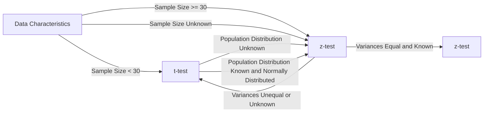
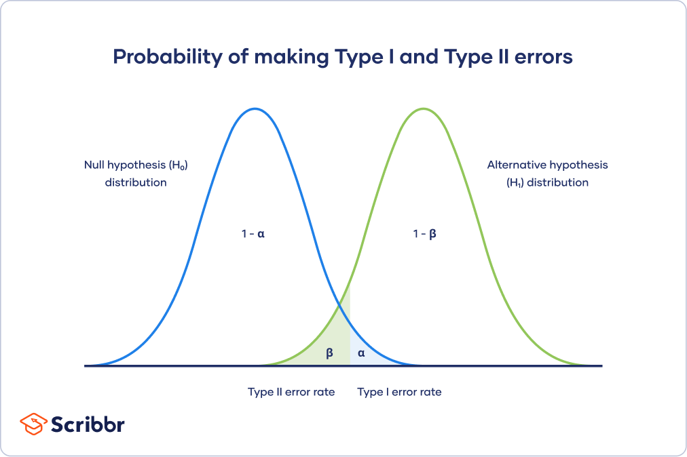
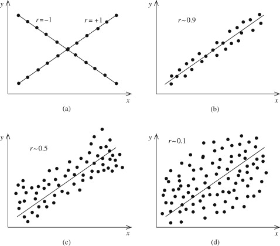
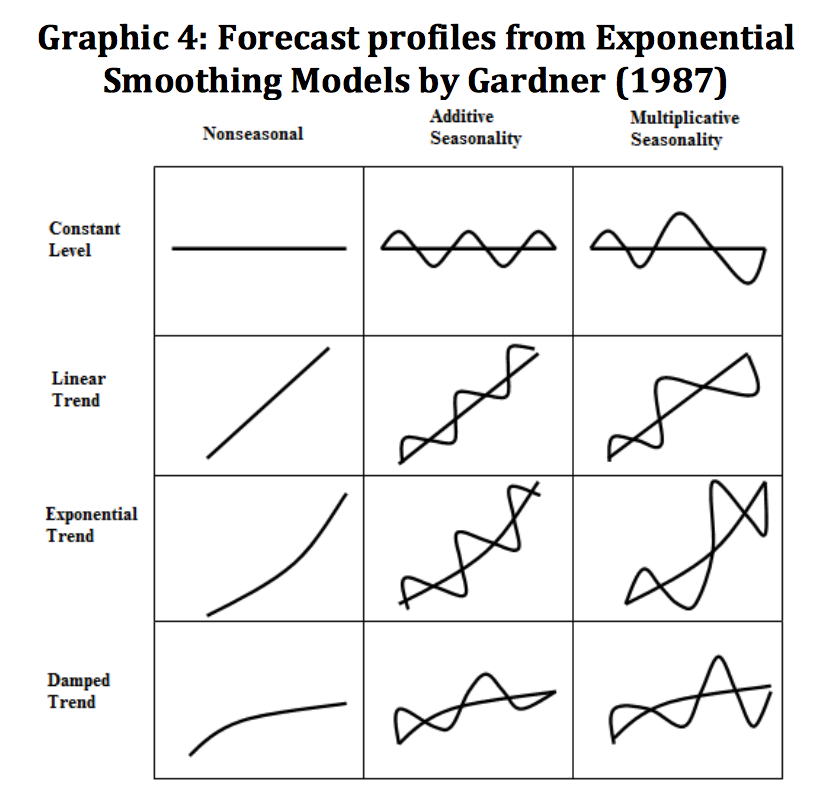

```py
# Importing the necessary packages
import numpy as np                                  # "Scientific computing"
import scipy.stats as stats                         # Statistical tests

import pandas as pd                                 # Data Frame
from pandas.api.types import CategoricalDtype

import random
import math

import matplotlib.pyplot as plt                     # Basic visualisation
from statsmodels.graphics.mosaicplot import mosaic  # Mosaic diagram
import seaborn as sns                                # Advanced data visualisation
from sklearn.linear_model import LinearRegression
import altair as alt                                # Alternative visualisation system
```

# [H1 - Samples](./Pythat0n/H1.md)

---

# [H2 - Analyse van 1 variabele](./Pythat0n/H2.md)

---

# [H3](./Pythat0n/H3.md)

**Student $t$-distribution in Python**  
Import scipy.stats  
For a $t$-distribution with df degrees of freedom: (df = degrees of freedom)

| **Function**           | **Purpose**                                                 |
| ---------------------- | ----------------------------------------------------------- |
| stats.t.pdf(x, df=d)   | Probability density for $x$                                 |
| stats.t.cdf(x, df=d)   | Left-tail probability 𝑃(𝑋 < x)                              |
| stats.t.sf(x, df=d)    | Right-tail probability 𝑃(𝑋 > x)                             |
| stats.t.isf(1-p, df=d) | p% of observations are expected to be lower than this value |

**Normal distribution in Python**
**Python functions**

Import scipy.stats  
For a normal distribution with mean m and standard deviation s:

| **Function**                        | **Purpose**                                             |
| ----------------------------------- | ------------------------------------------------------- |
| stats.norm.pdf(x, loc=m, scale=s)   | Probability density at $x$                              |
| stats.norm.cdf(x, loc=m, scale=s)   | Left-tail probability 𝑃(𝑋 < x)                          |
| stats.norm.sf(x, loc=m, scale=s)    | Right-tail probability 𝑃(𝑋 > x)                         |
| stats.norm.isf(1-p, loc=m, scale=s) | p% of observations are expected to be lower than result |



Requirements z-test:

- Random sample
- Sample groot genoeg (n >= 30)
  - als normaal verdeeld is is sample size niet relevant
- normaal verdeeld
- populatie standaard deviatie is gekend

indien 1 van deze niet voldaan is gebruik je de t-test en deze normaal verdeeld is

## 

# [H4 -> 2 kwalitatieve variabelen](./Pythat0n/H4.md)

H0 -> er is **geen** verband tussen de 2 variabelen
H1 -> er is **een** verband tussen de 2 variabelen

De Chi-kwadraattoets wordt gebruikt om associaties tussen categorische variabelen te beoordelen

Cramér's V meet de sterkte van deze associatie

en de goodness-of-fit test controleert of de waargenomen frequenties overeenkomen met de verwachte theoretische verdeling.

---

# [H5 -> 1 kalitatieve variabele en 1 kwantitatieve variabelen](./Pythat0n/H5.md)

Use the t-test for independence when comparing the means of two independent groups or conditions.

- 2 onafhankelijke groepen
- vergelijken van het gemiddelde van 2 groepen (niet perse even groot)
- gemiddelde van 2 verschillende groepen
- Groep met placebo en groep met medicijn

Use the paired t-test when analyzing paired or matched observations to compare means within the same group under different conditions or time points.

- 2 afhankelijke groepen
- zelfde test subjecten
- Voorbeeld zelfde auto met verschillende soorten benzine

Use Cohen's d as a measure of effect size to interpret the practical significance of the observed difference and compare effect sizes across different studies or conditions.

- Effectgrote -> hoe groot is het verschil tussen de 2 groepen

---

# [H6 -> 2 kwantitatieve variabelen](./Pythat0n/H6.md)

dependend variable -> y
independend variable -> x

Use regression analysis when you want to understand the relationship between a dependent variable and independent variables, and predict the value of the dependent variable.

Use the correlation coefficient when you want to measure the strength and direction of the linear relationship between two variables.

- r -> 0 -> geen correlatie -> alle punten liggen verspreid
- r -> 1 -> positieve correlatie -> alle punten liggen op 1 lijn stijgend
- r -> -1 -> negatieve correlatie -> alle punten liggen op 1 lijn dalend



Use the coefficient of determination (R-squared) to assess the model fit, compare models, and interpret the proportion of variance explained by the independent variables.

- r² -> 0 -> zwakke correlatie
- r² -> 1 -> sterke correlatie

---

# [H7 -> time series](./Pythat0n/H7.md)

- moving averages
  - simple moving average
  - weighted moving average
    - exponential moving average
- exponential smoothing
  - single exponential smoothing -> exponential smoothing
    - geen trend of seasonality
  - double exponential smoothing -> Holt's method
    - trend
  - triple exponential smoothing -> Holt-Winters method
    - trend en seasonality


