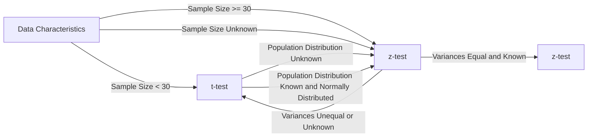

```py
# Importing the necessary packages
import numpy as np                                  # "Scientific computing"
import scipy.stats as stats                         # Statistical tests

import pandas as pd                                 # Data Frame
from pandas.api.types import CategoricalDtype

import matplotlib.pyplot as plt                     # Basic visualisation
from statsmodels.graphics.mosaicplot import mosaic  # Mosaic diagram
import seaborn as sns                                # Advanced data visualisation
from sklearn.linear_model import LinearRegression   
```

H1
```py

```


H3
- z-test
    - right-tailed
    - left-tailed
    - two-tailed
- t-test
    - right-tailed
    - left-tailed
    - two-tailed

H4 -> 2 kwalitatieve variabelen
- chi-quadraat test voor onafhankelijkheid
- goodness of fit test -> controleren of sample representatief is voor de populatie
- standardised residuals -> kijken of uw sample overrepresentatief is voor een bepaalde groep of niet

h5 -> 1 kalitatieve variabele en 1 kwantitatieve variabele
- two sample t-test
    - vergelijken van het gemiddelde van 2 groepen (niet perse even groot)
    - gemiddelde van 2 verschillende groepen
- paired samples
    - vergelijken van dingen op dezelfde groep bv
    - Voorbeelden 
    ```
        Before and after measurements: Paired samples are often used when you want to compare the measurements of the same variable before and after a treatment or intervention. For example, you might measure the blood pressure of individuals before and after they undergo a specific treatment to see if there is a significant change.

        Matched pairs: Paired samples analysis is useful when you have a natural pairing or matching between the observations in the two data sets. For instance, in a study comparing the effectiveness of two different drugs, you might pair each participant with another participant who has similar characteristics, such as age, gender, or disease severity. Then, you would measure the outcomes for each pair under the different drug conditions.

        Repeated measures: Paired samples can be used when you have multiple measurements taken on the same subject over time or under different conditions. This could include measuring variables like reaction time, performance scores, or pain levels before and after different treatments within the same individuals.
    ```

h6 -> 2 kwantitatieve variabelen
- regressie
- covariantie + R + R^2

H7 -> time series
- moving averages
    - simple moving average
    - weighted moving average
    - exponential moving average
- exponential smoothing
    - single exponential smoothing -> exponential smoothing
    - double exponential smoothing -> Holt's method
    - triple exponential smoothing -> Holt-Winters method

