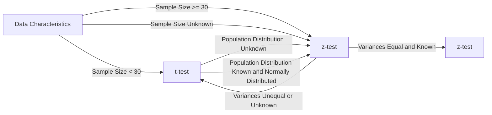

# H3

Discrete random variable -> een variabele die een beperkt aantal waardes kan aannemen
Continuous random variable -> een variabele die een oneindig aantal waardes kan aannemen

- Kans type 1 fout = alpha

## Central Limit Theorem

- De som van een groot aantal onafhankelijke random variabelen is ongeveer normaal verdeeld
- Hoe groter de steekproef, hoe beter de benadering

- Hier is de sigma ALTIJD bij sample = **standaardafwijking / sqrt(n)**

### The normal distribution

#### Plotting density function of a normal distribution

```py
# STANDAARD NORMAL DISTRIBUTIE -> mean = 0, std = 1
# Take 100 values for the X-axis, between -4 and 4, evenly spaced
x = np.linspace(-4, +4, num=101)
y = stats.norm.pdf(x, 0, 1)
# Plot the probability density function (pdf) for these X-values
plt.plot(x, y)

# voor een normale distributie met mean = 5 en std = 1.5 -> de vorm van de grafiek is identiek gewoon op andere schaal
m = 5    # Gemiddelde
s = 1.5  # Standaardafwijking
x = np.linspace(m - 4 * s, m + 4 * s, num=201)
plt.plot(x, stats.norm.pdf(x, loc=m, scale=s))

```

#### Plotting histogram of a sample with theoretical probability density

```py
# Histogram of the sample
plt.hist(sample, bins=20, density=True, label="Histogram of the sample")
# of
sns.distplot(sample, kde=True, label="Histogram of the sample")

```

#### Probability distribution in the normal distribution

**Student $t$-distribution in Python**  
Import scipy.stats  
For a $t$-distribution with df degrees of freedom: (df = degrees of freedom)

| **Function**           | **Purpose**                                                 |
| ---------------------- | ----------------------------------------------------------- |
| stats.t.pdf(x, df=d)   | Probability density for $x$                                 |
| stats.t.cdf(x, df=d)   | Left-tail probability 𝑃(𝑋 < x)                              |
| stats.t.sf(x, df=d)    | Right-tail probability 𝑃(𝑋 > x)                             |
| stats.t.isf(1-p, df=d) | p% of observations are expected to be lower than this value |

**Normal distribution in Python**
**Python functions**

Import scipy.stats  
For a normal distribution with mean m and standard deviation s:

| **Function**                        | **Purpose**                                             |
| ----------------------------------- | ------------------------------------------------------- |
| stats.norm.pdf(x, loc=m, scale=s)   | Probability density at $x$                              |
| stats.norm.cdf(x, loc=m, scale=s)   | Left-tail probability 𝑃(𝑋 < x)                          |
| stats.norm.sf(x, loc=m, scale=s)    | Right-tail probability 𝑃(𝑋 > x)                         |
| stats.norm.isf(1-p, loc=m, scale=s) | p% of observations are expected to be lower than result |

#### More examples of probability calculations

### confidence intervals

- confidence interval -large sample -> een interval waarin de parameter met een bepaalde kans ligt

```py
# Step 1.
m = 324.6      # Sample mean
s = 2.5      # Population standard deviation
n = 45      # Sample size
alpha = .05  # 1 - alpha is the confidence level

# Step 2.
z = stats.norm.isf(alpha/2)
print("z-score: %.5f" % z)

# Step 3.
lo = m - z * s / np.sqrt(n)
hi = m + z * s / np.sqrt(n)
print("Confidence interval: [%.4f, %.4f]" % (lo, hi))
```

- confidence interval -small sample -> students t test

```py
# Step 1.
m = 5.2      # Sample mean
s = 1.5      # Sample (!) standard deviation
n = 15       # Sample size
alpha = .05  # 1 - alpha is the confidence level

# Stap 2.
t = stats.t.isf(alpha/2, df = n - 1)
print("t-score: %.5f" % t)

# Stap 3.
lo = m - t * s / np.sqrt(n)
hi = m + t * s / np.sqrt(n)
print("Confidence interval: [%.4f, %.4f]" % (lo, hi))
```

---



Requirements z-test:

- Random sample
- Sample groot genoeg (n >= 30)
  - als normaal verdeeld is is sample size niet relevant
- normaal verdeeld
- populatie standaard deviatie is gekend

indien 1 van deze niet voldaan is gebruik je de t-test en deze normaal verdeeld is

## Z-test

### right-tailed

```py
## RIGHT TAIL Z-TEST
#Step 1: formulate the null and alternative hypotheses
#- H0: μ = 100
#- H1: μ > 100

#Step 2: specify the significance level
# Properties of the sample:
n = 50      # sample size
sm = 20.2  # sample mean
s = 0.4    # population standard deviation (assumed to be known)
a = 0.05    # significance level (chosen by the researcher)
m0 = 20.0    # hypothetical population mean (H0)

# Plotting the sample distribution
# Gauss-curve plot:
# X-values
dist_x = np.linspace(m0 - 4 * s/np.sqrt(n), m0 + 4 * s/np.sqrt(n), num=201)
# Y-values for the Gauss curve
dist_y = stats.norm.pdf(dist_x, m0, s/np.sqrt(n))
fig, dplot = plt.subplots(1, 1)
# Plot the Gauss-curve
dplot.plot(dist_x, dist_y)
# Show the hypothetical population mean with an orange line
dplot.axvline(m0, color="orange", lw=2)
# Show the sample mean with a red line
dplot.axvline(sm, color="red")

#Step 3: compute the test statistic (red line in the plot)
# Hier is dat 20.2

#Step 4:
## method 1
# Determine the $p$-value and reject $H_0$ if $p < \alpha$.
#The $p$-value is the probability, if the null hypothesis is true, to obtain
# a value for the test statistic that is at least as extreme as the
# observed value
p = stats.norm.sf(sm, loc=m0, scale=s/np.sqrt(n))
print("p-value: %.5f" % p)
if(p < a):
    print("p < a: reject H0")
else:
    print("p > a: do not reject H0")

## method 2
# An alternative method is to determine the critical region, i.e. the set of all values for the sample mean where $H_0$ may be rejected.
# The boundary of that area is called the critical value $g$. To the left of it you can't reject $H_0$ (acceptance region), to the right you can (critical region). The area of the acceptance region is $1 - \alpha$, the area of the critical region is $\alpha$.
g = stats.norm.isf(a, loc = m0, scale = s / np.sqrt(n))
print("Critical value g ≃ %.3f" % g)
if (sm < g):
    print("sample mean = %.3f < g = %.3f: do not reject H0" % (sm, g))
else:
    print("sample mean = %.3f > g = %.3f: reject H0" % (sm, g))


# Step 5
# We can conclude that if we assume that  $H_0$  is true, the probability to draw a sample from this population with this particular value for  $\bar{x}$  is very small indeed. With the chosen significance level, we can reject the null hypothesis.

```

### left-tailed

```py
## LEFT TAIL Z-TEST
#Step 1: formulate the null and alternative hypotheses
#- H0: μ = 100
#- H1: μ < 100

#Step 2: specify the significance level
# Properties of the sample:
n = 50      # sample size
sm = 19.94  # sample mean
s = 0.4    # population standard deviation (assumed to be known)
a = 0.05    # significance level (chosen by the researcher)
m0 = 20.0    # hypothetical population mean (H0)

# Plotting the sample distribution
# Gauss-curve plot:
# X-values
dist_x = np.linspace(m0 - 4 * s/np.sqrt(n), m0 + 4 * s/np.sqrt(n), num=201)
# Y-values for the Gauss curve
dist_y = stats.norm.pdf(dist_x, m0, s/np.sqrt(n))
fig, dplot = plt.subplots(1, 1)
# Plot the Gauss-curve
dplot.plot(dist_x, dist_y)
# Show the hypothetical population mean with an orange line
dplot.axvline(m0, color="orange", lw=2)
# Show the sample mean with a red line
dplot.axvline(sm, color="red")

#Step 3: compute the test statistic (red line in the plot)
# Hier is dat 19.94

#Step 4:
## method 1
# Determine the $p$-value and reject $H_0$ if $p < \alpha$.
#The $p$-value is the probability, if the null hypothesis is true, to obtain
#a value for the test statistic that is at least as extreme as the
# observed value
p = stats.norm.cdf(sm, loc=m0, scale=s/np.sqrt(n))
print("p-value: %.5f" % p)
if(p < a):
    print("p < a: reject H0")
else:
    print("p > a: do not reject H0")

## method 2
# An alternative method is to determine the critical region, i.e. the set of all values for the sample mean where $H_0$ may be rejected.
# The boundary of that area is called the critical value $g$. To the right of it you can't reject $H_0$ (acceptance region), to the left you can (critical region). The area of the acceptance region is $\alpha$, the area of the critical region is $1 - \alpha$.
g = stats.norm.isf(1-a, loc = m0, scale = s / np.sqrt(n))
print("Critical value g ≃ %.3f" % g)
if (sm > g):
    print("sample mean = %.3f > g = %.3f: do not reject H0" % (sm, g))
else:
    print("sample mean = %.3f < g = %.3f: reject H0" % (sm, g))


# Step 5
#  We can conclude that there is not enough evidence to reject the
#  null hypothesis.
```

### two-tailed

```py
## TWo tailed Z-TEST
#Step 1: formulate the null and alternative hypotheses
#- H0: μ = 100
#- H1: μ != 100

#Step 2: specify the significance level
# Properties of the sample:
n = 50      # sample size
sm = 19.94  # sample mean
s = 0.4    # population standard deviation (assumed to be known)
a = 0.05    # significance level (chosen by the researcher)
m0 = 20.0    # hypothetical population mean (H0)


#Step 3: compute the test statistic (red line in the plot)
# Hier is dat 19.94

#Step 4:
## method 1
# Calculate the $p$-value and reject $H_0$ if $p < \alpha/2$ (why do we divide by 2?).
p = stats.norm.cdf(sm, loc=m0, scale=s/np.sqrt(n))
print("p-value: %.5f" % p)
if(p < a):
    print("p < a: reject H0")
else:
    print("p > a: do not reject H0")

## method 2
# In this case, we have two critical values: $g_1$ on the left of the mean and $g_2$ on the right. The acceptance region still has area $1-\alpha$ and the critical region has area $\alpha$.
g1 = stats.norm.isf(1-a/2, loc = m0, scale = s / np.sqrt(n))
g2 = stats.norm.isf(a/2, loc = m0, scale = s / np.sqrt(n))

print("Acceptance region [g1, g2] ≃ [%.3f, %.3f]" % (g1,g2))
if (g1 < sm and sm < g2):
    print("Sample mean = %.3f is inside acceptance region: do not reject H0" % sm)
else:
    print("Sample mean = %.3f is outside acceptance region: reject H0" % sm)

# Plotting the sample distribution
# Gauss-curve
# X-values
dist_x = np.linspace(m0 - 4 * s/np.sqrt(n), m0 + 4 * s/np.sqrt(n), num=201)
# Y-values
dist_y = stats.norm.pdf(dist_x, loc=m0, scale=s/np.sqrt(n))
fig, dplot = plt.subplots(1, 1)
# Plot
dplot.plot(dist_x, dist_y)
# Hypothetical population mean in orange
dplot.axvline(m0, color="orange", lw=2)
# Sample mean in red
dplot.axvline(sm, color="red")
acc_x = np.linspace(g1, g2, num=101)
acc_y = stats.norm.pdf(acc_x, loc=m0, scale=s/np.sqrt(n))
# Fill the acceptance region in light blue
dplot.fill_between(acc_x, 0, acc_y, color='lightblue')

# Step 5
#  So if we do not make a priori statement whether the actual population mean is either smaller or larger, then the obtained sample mean turns out to be sufficiently probable. We cannot rule out a random sampling error. Or, in other words, we *cannot* reject the null hypothesis here.
```

## t-test

### right-tailed

```py
# Right tailed t test
#Step 1: formulate the null and alternative hypotheses
#- H0: μ = 100
#- H1: μ > 100

#Step 2: specify the significance level
# Properties of the sample:
n = 50      # sample size
sm = 20.2  # sample mean
s = 0.4    # sample standard deviation (assumed to be known)
a = 0.05    # significance level (chosen by the researcher)
m0 = 20.0    # hypothetical population mean (H0)

# Plotting the sample distribution
# Gauss-curve plot:
# X-values
dist_x = np.linspace(m0 - 4 * s/np.sqrt(n), m0 + 4 * s/np.sqrt(n), num=201)
# Y-values for the Gauss curve
dist_y = stats.t.pdf(dist_x, loc = m0,scale = s/np.sqrt(n), df = n-1)
fig, dplot = plt.subplots(1, 1)
# Plot the Gauss-curve
dplot.plot(dist_x, dist_y)
# Show the hypothetical population mean with an orange line
dplot.axvline(m0, color="orange", lw=2)
# Show the sample mean with a red line
dplot.axvline(sm, color="red")

#Step 3: compute the test statistic (red line in the plot)
# Hier is dat: VUL IN

#Step 4:
## method 1
# Determine the $p$-value and reject $H_0$ if $p < \alpha$.
#The $p$-value is the probability, if the null hypothesis is true, to obtain
# a value for the test statistic that is at least as extreme as the
# observed value
p = stats.t.sf(sm, loc=m0, scale=s/np.sqrt(n), df=n-1)
print("p-value: %.5f" % p)
if(p < a):
    print("p < a: reject H0")
else:
    print("p > a: do not reject H0")

## method 2
# An alternative method is to determine the critical region, i.e. the set of all values for the sample mean where $H_0$ may be rejected.
# The boundary of that area is called the critical value $g$. To the left of it you can't reject $H_0$ (acceptance region), to the right you can (critical region). The area of the acceptance region is $1 - \alpha$, the area of the critical region is $\alpha$.
g = stats.t.isf(a, loc = m0, scale = s / np.sqrt(n), df = n-1)
print("Critical value g ≃ %.3f" % g)
if (sm < g):
    print("sample mean = %.3f < g = %.3f: do not reject H0" % (sm, g))
else:
    print("sample mean = %.3f > g = %.3f: reject H0" % (sm, g))


# Step 5
# We can conclude that if we assume that  $H_0$  is true, the probability to draw a sample from this population with this particular value for  $\bar{x}$  is very small indeed. With the chosen significance level, we can reject the null hypothesis.

```

### left-tailed

```py
## LEFT TAIL t-TEST
#Step 1: formulate the null and alternative hypotheses
#- H0: μ = 100
#- H1: μ < 100

#Step 2: specify the significance level
# Properties of the sample:
n = 50      # sample size
sm = 19.94  # sample mean
s = 0.4    # sample standard deviation (assumed to be known)
a = 0.05    # significance level (chosen by the researcher)
m0 = 20.0    # hypothetical population mean (H0)

# Plotting the sample distribution
# Gauss-curve plot:
# X-values
dist_x = np.linspace(m0 - 4 * s/np.sqrt(n), m0 + 4 * s/np.sqrt(n), num=201)
# Y-values for the Gauss curve
dist_y = stats.t.pdf(dist_x, loc=  m0, scale= s/np.sqrt(n), df = n-1)
fig, dplot = plt.subplots(1, 1)
# Plot the Gauss-curve
dplot.plot(dist_x, dist_y)
# Show the hypothetical population mean with an orange line
dplot.axvline(m0, color="orange", lw=2)
# Show the sample mean with a red line
dplot.axvline(sm, color="red")

#Step 3: compute the test statistic (red line in the plot)
# Hier is dat 19.94

#Step 4:
## method 1
# Determine the $p$-value and reject $H_0$ if $p < \alpha$.
#The $p$-value is the probability, if the null hypothesis is true, to obtain
#a value for the test statistic that is at least as extreme as the
# observed value
p = stats.t.cdf(sm, loc=m0, scale=s/np.sqrt(n), df=n-1)
print("p-value: %.5f" % p)
if(p < a):
    print("p < a: reject H0")
else:
    print("p > a: do not reject H0")

## method 2
# An alternative method is to determine the critical region, i.e. the set of all values for the sample mean where $H_0$ may be rejected.
# The boundary of that area is called the critical value $g$. To the right of it you can't reject $H_0$ (acceptance region), to the left you can (critical region). The area of the acceptance region is $\alpha$, the area of the critical region is $1 - \alpha$.
g = stats.t.isf(1-a, loc = m0, scale = s / np.sqrt(n), df=n-1)
print("Critical value g ≃ %.3f" % g)
if (sm > g):
    print("sample mean = %.3f > g = %.3f: do not reject H0" % (sm, g))
else:
    print("sample mean = %.3f < g = %.3f: reject H0" % (sm, g))


# Step 5
#  We can conclude that there is not enough evidence to reject the
#  null hypothesis.

```

### two-tailed

```py
## TWo tailed Z-TEST
#Step 1: formulate the null and alternative hypotheses
#- H0: μ = 100
#- H1: μ != 100

#Step 2: specify the significance level
# Properties of the sample:
n = 50      # sample size
sm = 19.94  # sample mean
s = 0.4    # sample standard deviation (assumed to be known)
a = 0.05    # significance level (chosen by the researcher)
m0 = 20.0    # hypothetical population mean (H0)


#Step 3: compute the test statistic (red line in the plot)
# Hier is dat 19.94

#Step 4:
## method 1
# Calculate the $p$-value and reject $H_0$ if $p < \alpha/2$ (why do we divide by 2?).
p = stats.t.cdf(sm, loc=m0, scale=s/np.sqrt(n), df=n-1)
print("p-value: %.5f" % p)
if(p < a):
    print("p < a: reject H0")
else:
    print("p > a: do not reject H0")

## method 2
# In this case, we have two critical values: $g_1$ on the left of the mean and $g_2$ on the right. The acceptance region still has area $1-\alpha$ and the critical region has area $\alpha$.
g1 = stats.t.isf(1-a/2, loc = m0, scale = s / np.sqrt(n), df = n-1)
g2 = stats.t.isf(a/2, loc = m0, scale = s / np.sqrt(n), df = n-1)

print("Acceptance region [g1, g2] ≃ [%.3f, %.3f]" % (g1,g2))
if (g1 < sm and sm < g2):
    print("Sample mean = %.3f is inside acceptance region: do not reject H0" % sm)
else:
    print("Sample mean = %.3f is outside acceptance region: reject H0" % sm)

# Plotting the sample distribution
# Gauss-curve
# X-values
dist_x = np.linspace(m0 - 4 * s/np.sqrt(n), m0 + 4 * s/np.sqrt(n), num=201)
# Y-values
dist_y = stats.t.pdf(dist_x, loc=m0, scale=s/np.sqrt(n), df=n-1)
fig, dplot = plt.subplots(1, 1)
# Plot
dplot.plot(dist_x, dist_y)
# Hypothetical population mean in orange
dplot.axvline(m0, color="orange", lw=2)
# Sample mean in red
dplot.axvline(sm, color="red")
acc_x = np.linspace(g1, g2, num=101)
acc_y = stats.t.pdf(acc_x, loc=m0, scale=s/np.sqrt(n),  df=n-1)
# Fill the acceptance region in light blue
dplot.fill_between(acc_x, 0, acc_y, color='lightblue')

# Step 5
#  So if we do not make a priori statement whether the actual population mean is either smaller or larger, then the obtained sample mean turns out to be sufficiently probable. We cannot rule out a random sampling error. Or, in other words, we *cannot* reject the null hypothesis here.
```
