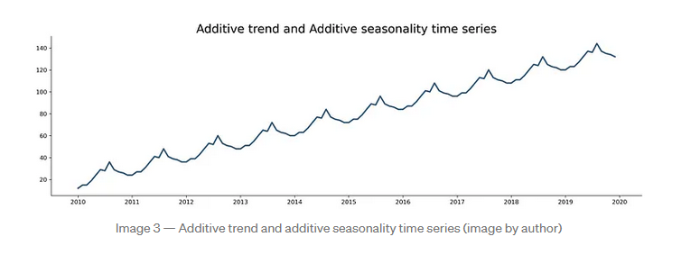
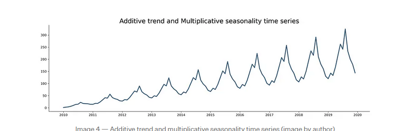

# H7 Time Series Analysis

## Time whatttt?

- Analyse van data die geordend is in tijd over een bepaalde periode
  - bv Supermarkt: hoeveelheid verkochte producten per dag
  - bv Aandelen: prijs van een aandeel per dag
- Op deze data kunnen we dan voorspellingen maken
  - bv Supermarkt: hoeveelheid verkochte producten per dag in de toekomst
  - bv Aandelen: prijs van een aandeel per dag in de toekomst

## Components of Time Series

- Trend: de algemene richting van de data
  - bv stijgend, dalend, constant
- Seasonality: herhaling van patronen in de data
  - bv. elke maandag is er een piek in de verkoop
- Noise: onregelmatigheden in de data
  - random variaties die niet te verklaren zijn door de trend of seasonality
- Cyclical: herhaling van patronen in de data die niet op een vaste tijdsinterval gebeuren

## moving averages

### simple moving average

    ```py
    # simple moving average
    data['SMA3'] = data['Close'].rolling(window=3).mean()
    data['SMA5'] = data['Close'].rolling(window=5).mean()
    data['SMA10'] = data['Close'].rolling(window=10).mean()

    # Simple moving average with shift -> to predict the future je zet ze een rij naar onder op de plek waar dit de predictie is voor die dag bv
    data['SMA3_forecast'] = data['Close'].rolling(3).mean().shift(1)
    data['SMA5_forecast'] = data['Close'].rolling(5).mean().shift(1)
    data['SMA10_forecast'] = data['Close'].rolling(10).mean().shift(1)
    ```

### weighted moving average -> recentere data krijgt meer gewicht

- exponential moving average
  If $\alpha$ is close to 0, then 1 − $\alpha$ is close to 1 and the weights
  decrease very slowly. In other words, observations from the distant past continue to have a large influence on the next forecast. This means that the graph of the forecasts will be relatively
  smooth, just as with a large span in the moving averages method. But if $\alpha$ is close to 1, the weights decrease rapidly, and only very recent observations have much influence on
  the next forecast.

  ```py
  # exponential moving average
  # alpha
  data['EMA_0.1'] = data['Close'].ewm(alpha=.1, adjust=False).mean()
  data['EMA_0.5'] = data['Close'].ewm(alpha=.5, adjust=False).mean()
  ```

## Exponential smoothing

### single exponential smoothing

-> exponential moving average (EMA)

-> geen trend of seasonality

```py
# single exponential smoothing
# smoothing_level=0.1 -> alpha
from statsmodels.tsa.holtwinters import SimpleExpSmoothing
data_ses = SimpleExpSmoothing(data['Close']).fit(smoothing_level=0.1, optimized=True)
data['SES'] = data_ses.fittedvalues
data.head()

data.plot(y=['Close',  'SES'], figsize=[10,5])

#Predicting the future
data_ses_fcast = data_ses.forecast(12)

data.plot(y=['Close',  'SES'], figsize=[10,5])
data_ses_fcast.plot(marker='.', legend=True, label='Forecast')
```

### double exponential smoothing

-> Holt's method

-> trend maar geen seasonality

```py
# double exponential smoothing
from statsmodels.tsa.api import Holt

data_des = Holt(data['Close']).fit(smoothing_level=.1, smoothing_trend=.2)

data['DES'] = data_des.fittedvalues

data.plot(y=['Close',  'DES'], figsize=[10,5])

#Predicting the future
data_des_fcast = data_des.forecast(12)

data['number_of_heavily_wounded'].plot(marker='o', legend=True) # Observations
data['DES'].plot(legend=True, label='DES fitted values', figsize=[10,5])
data_ses_fcast.plot(marker='.', legend=True, label='Forecast SES')
data_des_fcast.plot(marker='.', legend=True, label='Forecast DES')

```

### triple exponential smoothing

-> Holt-Winters method

-> trend en seasonality

2 Soorten:

- additive
  - seasonality is constant
    
- multiplicative
  - seasonality is not constant
    

```py
# triple exponential smoothing
# je kunt de freq aanpassen naar bv D voor days of MS voor months
# additive
from statsmodels.tsa.holtwinters import ExponentialSmoothing

train = data.number_of_heavily_wounded
test = data.number_of_heavily_wounded

model = ExponentialSmoothing(train,
  trend='add', seasonal='add',
  seasonal_periods=12, freq='MS').fit()

train.plot(legend=True, label='train')
test.plot(legend=True, label='test')
model.fittedvalues.plot(legend=True, label='fitted')

# multiplicative
from statsmodels.tsa.holtwinters import ExponentialSmoothing

train = data.number_of_heavily_wounded
test = data.number_of_heavily_wounded

model = ExponentialSmoothing(train,
  trend='add', seasonal='mul',
  seasonal_periods=12, freq='MS').fit()

train.plot(legend=True, label='train')
test.plot(legend=True, label='test')
model.fittedvalues.plot(legend=True, label='fitted')

#Predicting the future
model_predicted = model.forecast(12)

train.plot(legend=True, label='train')
model.fittedvalues.plot(legend=True, label='fitted')

test.plot(legend=True, label='test')
model_predicted.plot(legend=True, label='predicted')

plt.title('Train, test, fitted & predicted values using Holt-Winters')
```

### Model ìnternals

```py
# Model internals: last estimate for level, trend and seasonal factors:
print(f'level: {wounded_hw.level[83]}')
print(f'trend: {wounded_hw.trend[83]}')
print(f'seasonal factor: {wounded_hw.season[72:84]}')
```
